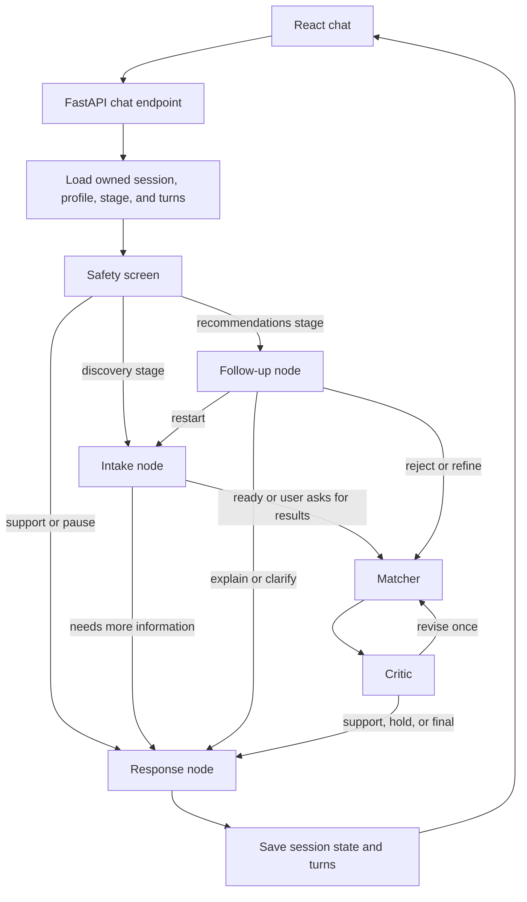

# Career Navigator — Project Guide

This guide explains the project in plain language: what it does, how a request moves through the system, how the database and AI pieces fit together, how to run it, and how to describe it in an interview.

## 1. The project in one paragraph

Career Navigator is a web chat for exploring career directions over multiple turns. It saves each user's sessions, profile, and conversation. A LangGraph workflow first checks for safety needs, then either gathers more profile information, handles follow-up questions about existing recommendations, or searches a small career knowledge base. OpenRouter supplies chat responses and semantic embeddings when configured. A Critic step checks recommendations for consistency and safety before the assistant returns them.

The agents are workflow roles implemented as nodes in one LangGraph application. They are not separate deployed services or autonomous processes.

## 2. What a user can do

- Create an account, sign in, refresh a session, log out, and reset a forgotten password.
- Create several career-exploration sessions and reopen their saved conversation history.
- Answer conversational questions about interests, work style, skills, and job preferences.
- Ask to see recommendations before the normal profile-completeness criteria are met.
- Receive career suggestions grounded in retrieved career profiles, with similarity scores and possible mismatches.
- Ask about a recommendation, reject it, add a new preference, or restart discovery.

## 3. Technology used

| Part | Technology | Purpose |
|---|---|---|
| Frontend | React, TypeScript, Vite | Chat, sign-in forms, session list, and API calls |
| API | Python, FastAPI | Authentication, session endpoints, and chat requests |
| Workflow | LangGraph | Typed state, agent nodes, and conditional routing |
| LLM integration | LangChain `ChatOpenAI` + OpenRouter | Structured chat generation and retries |
| Structured data | Pydantic | Validate model results before they are used |
| Retrieval | OpenRouter embeddings + cosine similarity | Find relevant career profiles |
| Persistence | SQLAlchemy with SQLite or MySQL | Users, sessions, turns, recommendations, and tokens |
| Passwords/tokens | bcrypt-SHA256, JWT | Password hashing and API authentication |

## 4. How one chat request works

The frontend sends the new message and access token to `POST /sessions/{id}/chat`. The API verifies the user owns that session, loads its saved profile, stage, and relevant conversation history, and invokes the compiled LangGraph. The graph returns a reply and updated state; the API saves the new profile, stage, user/assistant turns, and any recommendations.



### The nodes and their jobs

1. **Safety screen** runs on every request. The model receives the conversation context; deterministic phrase checks provide an additional safeguard for obvious signals in the latest message. A serious signal routes to a support response, a concern routes to a pause response, and otherwise the saved stage decides whether to run Intake or Follow-up.
2. **Intake** updates the profile. It normally continues until it has interests, work style, and either skills/background or values/constraints, with enough concrete detail. The user can ask for results, and an eight-question cap prevents the system from asking indefinitely. If the model is unavailable, a small deterministic extractor and follow-up question are used.
3. **Follow-up** is used after recommendations. It classifies the message as a rejection, preference refinement, request for an explanation, restart, or other. Rejected career titles are persisted in the profile and filtered from later retrieval. A restart resets the profile and the model's conversation context for discovery; the saved transcript remains visible in the session.
4. **Matcher** builds a search query from the profile, retrieves the top career entries, and gives those entries and their scores to the model. It only keeps recommendation titles found in the retrieved entries. If the model is unavailable, it can make a basic evidence-based fallback from the retrieved entries.
5. **Critic** checks the recommendations against the conversation and retrieved evidence, and separately reviews safety. Deterministic checks also reject titles that were not retrieved or were previously rejected. It can send the Matcher through one revision before finalizing or holding the result.
6. **Response** turns the validated result into conversational text and returns the next stage to the API for persistence.

## 5. Session state and restart behavior

The session is persisted in SQLAlchemy tables, rather than relying on a process-local conversation variable. For each request, `main.py` rebuilds the graph input from the database: current profile, stage, turns, and the last displayed recommendation titles. The session stage is written back after the graph finishes.

The app does not currently enable a LangGraph checkpointer. `graph.py` exposes an optional `build_graph(checkpointer=...)`, but production persistence in this demo comes from the API loading and saving state in the database on every turn.

The `history_start_index` in the profile marks where a restarted discovery context begins. That lets the graph ignore the earlier transcript for new profile extraction without deleting the user's saved history.

## 6. Career knowledge base and RAG

The curated source is [`backend/app/careers.md`](backend/app/careers.md). It currently contains 10 career profiles. Each profile has a title and fields such as what the job does, skills, work style, and outlook.

### Retrieval pipeline

1. Convert each career profile into a text passage.
2. Send all passages to OpenRouter's embeddings endpoint using `OPENROUTER_EMBEDDING_MODEL`.
3. Cache the document vectors in `backend/data/career_embeddings.json`. The cache fingerprint includes the model and career text, so changing either causes the documents to be embedded again.
4. Combine the user's saved interests, skills, work style, and constraints into a query and embed it with the same model.
5. Normalize the vectors and calculate cosine similarity using their dot product. The top four entries go to Matcher with their scores.
6. Matcher is asked to use only those entries; the code checks that its career titles are in the retrieved set. The chat UI also displays the retrieved titles so retrieval is visible.

The default embedding model is `nvidia/nemotron-3-embed-1b:free`. Free models can be rate-limited or unavailable, and their data-use terms matter: the README cautions against sending confidential or sensitive personal information to the free NVIDIA endpoint. Online mode sends the career profile to the configured providers.

If no OpenRouter key is configured, or embeddings fail after retries, retrieval uses deterministic feature-hashed vectors locally. This keeps the demo usable offline, but it is a weaker lexical fallback than semantic embeddings. It is accurate to describe the configured path as semantic RAG and the offline path as hashed-vector similarity.

## 7. OpenRouter and model output validation

The chat adapter in `graph.py` uses LangChain's `ChatOpenAI` with OpenRouter's OpenAI-compatible chat endpoint. It requests JSON output and parses it with `PydanticOutputParser`. The schemas define the expected fields for Intake, Matcher, Critic, Safety, and Follow-up. Invalid or unavailable model output falls back to node-specific logic.

Configuration is read from `backend/.env`:

| Setting | Default in `.env.example` | Used for |
|---|---|---|
| `OPENROUTER_API_KEY` | blank | Authenticates chat and embedding requests |
| `OPENROUTER_MODEL` | `openrouter/free` | Chat generation |
| `OPENROUTER_EMBEDDING_MODEL` | `nvidia/nemotron-3-embed-1b:free` | RAG embeddings |

Chat retries use a LangChain chain limit of three attempts, while the OpenAI client can retry each attempt twice and honor provider `Retry-After` headers for supported errors. That can multiply the number of outbound requests during a prolonged failure. A 30–120 second cooldown follows exhausted rate-limit/server-error responses. Embedding calls have their own two-attempt retry path. No API key should be placed in frontend code or committed to source control.

## 8. Database tables

The SQLAlchemy models are in [`backend/app/models.py`](backend/app/models.py). [`backend/schema.sql`](backend/schema.sql) documents the MySQL 8 version.

| Table | What it stores |
|---|---|
| `users` | Email and password hash |
| `career_sessions` | User-owned session, current stage, profile JSON, and summary |
| `conversation_turns` | Each user and assistant message |
| `recommendations` | Career titles, rationale, and the retrieved sources used |
| `refresh_tokens` | Server-side refresh-token IDs, expiry, and revocation state |
| `password_resets` | Hashed one-time reset tokens, expiry, and used state |

The `.env.example` selects SQLite for a low-setup local demo. To use MySQL, set `DATABASE_URL` to a valid MySQL URL and start the MySQL service/database first. If there is no `.env` and no `DATABASE_URL`, the Settings fallback is a local MySQL URL; the backend therefore needs a reachable MySQL service in that configuration. Application queries use SQLAlchemy's ORM and parameter binding.

## 9. Authentication flow

- **Signup:** validates email/password, stores a bcrypt-SHA256 password hash, and returns access and refresh JWTs.
- **Login:** compares the submitted password with the stored hash and returns a new token pair.
- **Protected endpoints:** FastAPI checks the access JWT, user existence, and session ownership.
- **Refresh:** validates the refresh JWT against its database record, revokes that record, and issues a replacement pair. Reusing the old refresh token is rejected.
- **Logout:** revokes the refresh-token record. The current access JWT remains usable until it expires.
- **Forgot/reset password:** the demo prints the one-time reset token in the backend console, stores only its SHA-256 digest for 30 minutes, consumes it on reset, and revokes existing refresh tokens.

This is suitable for a local demo, not a production authentication design. Tokens are stored in browser `localStorage`, password-reset delivery is console-only, and production would need rate limits, monitoring, email delivery, secure cookie/CSRF decisions, and stronger secret management.

## 10. API routes

| Route | Purpose | Authentication |
|---|---|---|
| `GET /health` | Basic health check | No |
| `POST /auth/signup` | Create account | No |
| `POST /auth/login` | Sign in | No |
| `POST /auth/refresh` | Rotate tokens | Refresh token in request body |
| `POST /auth/logout` | Revoke refresh token | Access token |
| `POST /auth/forgot-password` | Request demo reset token | No |
| `POST /auth/reset-password` | Set a new password with reset token | No |
| `GET /auth/me` | Return current user | Access token |
| `POST /sessions` | Create a session | Access token |
| `GET /sessions` | List current user's sessions | Access token |
| `GET /sessions/{id}` | Read session/profile/turns | Access token and ownership check |
| `POST /sessions/{id}/chat` | Run one graph turn and persist output | Access token and ownership check |

## 11. Frontend behavior

The frontend lives in `frontend/src`. It offers signup/login/reset screens, a conversation list, a chat transcript, and a message composer. It stores the access and refresh tokens in `localStorage`, adds the access token to protected API requests, and tries one refresh when an API call returns 401. The backend stays the source of truth for session history and profile state.

Run the frontend with `npm run dev` from `frontend/`. The default API URL is `http://localhost:8000`; `VITE_API_URL` can override it.

## 12. Run the project

From PowerShell:

```powershell
cd backend
python -m venv .venv
.\.venv\Scripts\Activate.ps1
pip install -r requirements.txt
Copy-Item .env.example .env
# Add OPENROUTER_API_KEY and replace JWT_SECRET in .env.
uvicorn app.main:app --reload
```

In a second terminal:

```powershell
cd frontend
npm install
npm run dev
```

Open `http://localhost:5173`. Use the SQLite URL in `.env.example` for local development, or set up MySQL and update `DATABASE_URL` first. The database service must be running before the API starts when using MySQL.

## 13. Tests and current verification status

Run the backend suite from `backend/` with:

```powershell
pytest -q
```

The current tests cover offline retrieval ranking, intake routing from two profile states, signup/login/protected-session behavior, and refresh-token rotation/replay rejection. They do not cover live OpenRouter calls, the new post-recommendation follow-up routes, MySQL behavior, password-reset delivery, browser rendering/accessibility, or end-to-end UI flows.

The project has not had a full test run after the recent Follow-up/LangChain integration. Do not claim the current branch is fully passing until `pytest -q` is run and the new Follow-up paths are covered. Python syntax and dependency presence were checked after implementation; that is not a substitute for running the suite.

## 14. Interview explanation

### 30-second version

“I built a conversational career guidance app with React, FastAPI, and LangGraph. It saves each user's profile and chat history in SQLAlchemy-backed sessions. A graph routes each turn through a safety check, then into profile intake or post-recommendation follow-up. The matcher uses OpenRouter embeddings to retrieve relevant entries from a curated set of career profiles, and a critic checks recommendations against the user's constraints and retrieved evidence before they are shown.”

### A deeper walkthrough

“The main design decision was to make this a stateful workflow rather than a one-shot questionnaire. Each request reloads the profile, session stage, and conversation from the database. LangGraph conditional edges decide whether the user needs more intake, wants to refine or reject a previous recommendation, or is ready for matching. The RAG path embeds the career corpus and user profile with the same OpenRouter embedding model, caches document vectors, and ranks with cosine similarity. The Matcher only receives retrieved career entries, and the Critic can trigger one revision. Pydantic validates structured model output, and node fallbacks keep a no-key demo usable.”

### Questions an interviewer may ask

**Why LangGraph?**
It makes the stages and conditional routes explicit and keeps per-turn state visible. The graph can route to different nodes and loop from Critic back to Matcher, rather than hiding the workflow inside one long prompt.

**How do you know recommendations are grounded?**
The matcher receives the retrieved entries and similarity scores, is instructed to use only those entries, and the code filters out recommendation titles not present in retrieval. The Critic also checks consistency and can request one revision. This improves grounding, but it does not guarantee every sentence is factually perfect.

**How does the app remember users?**
FastAPI loads the user's session record, profile JSON, stage, and stored turns at the start of each chat request, then saves the updated state and turns after the graph returns. Session endpoints check both the authenticated user and session ID.

**What happens when OpenRouter is unavailable?**
Chat requests use bounded retries and a cooldown. The app then falls back to deterministic profile extraction, intent handling, or recommendation formatting. Retrieval falls back to local feature-hashed vectors if embeddings are unavailable. The fallback keeps the demo responsive but is less capable than the online semantic path.

**What would you improve next?**
Add tests for Follow-up routing, rejected-career persistence, and restart history boundaries; run the suite against SQLite and a MySQL service; add end-to-end chat/auth tests; and review provider privacy/cost settings before using real personal data. For multi-institution support, add tenant IDs to users, sessions, and career content and enforce tenant filtering in every query and retrieval operation.

## 15. Honest limitations to disclose

- This is a single-tenant demo; it does not yet have institution/cohort isolation.
- Free OpenRouter models can be rate-limited, unavailable, or change over time.
- The offline feature-hash retrieval fallback is not equivalent to semantic embeddings.
- Safety screening is a lightweight routing safeguard, not clinical or emergency detection.
- The new Follow-up paths and current OpenRouter integration need a fresh full test run; live provider behavior has not been verified here.
- The browser stores bearer tokens in `localStorage`; production security should be reviewed before deployment.
