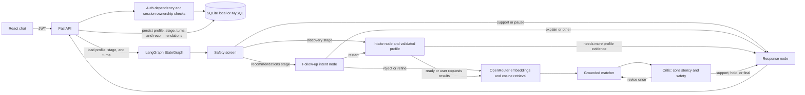

# Career Navigator

A multi-turn career guidance demo built with FastAPI, LangGraph, React + TypeScript, and SQLAlchemy. It stores a profile and conversation in user-owned sessions. OpenRouter provides chat generation and semantic embeddings; the default chat and embedding model IDs use OpenRouter's free options. The application also has deterministic offline fallbacks when no key is configured or a provider is unavailable.

## Run locally

Requirements: Python 3.11+, Node.js 20+, and (for the configured online models) an OpenRouter API key. The backend installs `langchain-openai` and the OpenAI SDK to call OpenRouter through LangChain.

```powershell
cd backend
python -m venv .venv
.\.venv\Scripts\Activate.ps1
pip install -r requirements.txt
Copy-Item .env.example .env
# Set OPENROUTER_API_KEY and a unique JWT_SECRET in .env.
uvicorn app.main:app --reload
```

In another terminal:

```powershell
cd frontend
npm install
npm run dev
```

Open `http://localhost:5173`. The supplied `.env.example` selects local SQLite. To use MySQL, set `DATABASE_URL` to a valid `mysql+pymysql://...` URL and make sure the MySQL service and database are running before starting the API. `backend/schema.sql` documents the MySQL 8 schema. The backend's Settings fallback (when no `.env` or `DATABASE_URL` is present) is a local MySQL URL.

`OPENROUTER_MODEL` defaults to `openrouter/free`. `OPENROUTER_EMBEDDING_MODEL` defaults to `nvidia/nemotron-3-embed-1b:free`; both can be changed to compatible model IDs. Free model availability and rate limits can vary. The free NVIDIA embedding endpoint has its own data-use terms; do not send confidential or sensitive personal information to it. The application sends the user's career profile to the configured embedding and chat providers when online mode is enabled.

## Authentication

- Signup validates email and password, hashes the password with bcrypt-SHA256, and returns short-lived access and refresh JWTs.
- Login verifies the stored hash. Protected session routes check the access token and enforce user ownership on every session query.
- Refresh tokens are recorded server-side and rotated on use to reject replay. Logout revokes its refresh token; an issued access token remains valid until its short expiry.
- Forgot-password returns a generic response. For this demo, a random one-time reset token is printed to the API console; only its SHA-256 digest is stored, with a 30-minute expiry. Reset consumes the token and revokes refresh tokens.

For a public deployment, add email delivery, rate limiting and abuse monitoring, secure cookie/CSRF handling if using cookies, secret rotation, and security event logging. The demo stores bearer tokens in browser localStorage for simplicity.

## Tests

From `backend/`, run:

```powershell
pytest -q
```

The suite covers offline similarity ranking, intake routing from different profile states, signup/login/protected session access, and refresh-token rotation/replay rejection. It does not exercise live OpenRouter generation or embeddings, MySQL-specific behavior, password-reset console delivery, browser accessibility/rendering, high concurrency, or end-to-end UI flows; those need provider credentials, a MySQL service, or browser automation. The retrieval test uses the deterministic offline vector fallback, so it needs no OpenRouter key.

## Architecture



### Routing, retrieval, and persistence

- Each chat request loads only the authenticated user's session, profile, stage, and relevant conversation history. LangGraph uses typed state, explicit nodes, and conditional edges. Safety can route directly to support or pause, or dispatch according to the saved session stage. Intake continues while required profile areas are missing; it proceeds when interests, work style, and either skills or values are covered, or when the user asks for results. An eight-question cap prevents intake from continuing indefinitely. After recommendations, the follow-up node can explain, reject, refine, restart, or ask what the user wants next. Rejected titles persist in the profile and are excluded from later matching. A restart begins a fresh profile/history context while leaving the saved session transcript available in the UI. Matching can route back through the critic once for revision, then the critic finalizes or holds unverified results.
- The curated knowledge base is `backend/app/careers.md` (10 career profiles). RAG embeds all career descriptions through OpenRouter, caches document vectors in `backend/data/career_embeddings.json` keyed by model and corpus fingerprint, embeds the current profile query, and ranks documents by cosine similarity. The top four entries and their scores are sent to the matcher. Output validation rejects invalid structured responses, and recommendation titles are restricted to retrieved entries. The UI displays retrieved career titles and scores.
- If `OPENROUTER_API_KEY` is missing or embeddings fail after transient-error retries, retrieval falls back to deterministic feature-hashed vectors. If chat generation is unavailable, intake, matching, follow-up, and safety have offline fallbacks. Online outputs are parsed by `PydanticOutputParser` and validated against Pydantic models before downstream use. The LangChain chat chain allows three attempts with exponential jitter; the OpenAI client can retry each chain call twice and honors provider `Retry-After` for supported errors, so total provider requests can multiply. A 30–120 second cooldown follows exhausted 429/5xx failures. Embedding requests allow two attempts with exponential backoff.
- SQLAlchemy persists users, sessions, profile/stage, conversation turns, recommendations, refresh tokens, and password-reset digests. `backend/schema.sql` is the corresponding MySQL 8 schema. Queries use SQLAlchemy parameter binding, and session endpoints filter by authenticated user ID.

### Multi-tenancy and scaling

To serve multiple institutions, add an `institutions` table and user memberships/roles, attach `institution_id` to users, sessions, and curated career content, and enforce tenant filtering in every repository query. Keep separate corpus versions and embedding namespaces per institution and filter before ranking. Add tenant-specific retention policies, encryption keys where required, and audit logs. For higher traffic, move vectors to a managed vector database, add database indexes and connection-pool limits, and run graph invocations in workers with bounded concurrency and provider-level rate limits.

## Provider references

- [OpenRouter chat API](https://openrouter.ai/docs/quickstart)
- [OpenRouter embeddings API](https://openrouter.ai/docs/api/api-reference/embeddings/create-embeddings)
- [Default free embedding model](https://openrouter.ai/nvidia/nemotron-3-embed-1b:free)
